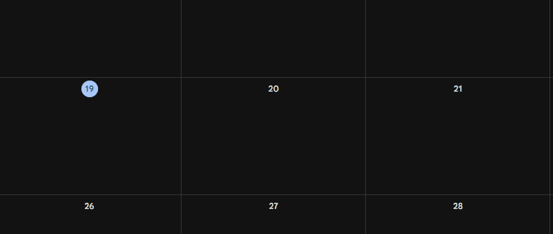

# Telegram Bot to Google Calendar Bridge
<a href="#GB">🇬🇧 English</a> | <a href="#IT">🇮🇹 Italiano</a>

---
## <p id="GB">🇬🇧 English</p>
### Summary
A powerful Telegram bot that integrates with Google Calendar, allowing users to manage events through natural language. The bot uses Google's Generative AI to parse event details and automatically adds them to your calendar.

### 🚀 Features
- **Natural Language Processing**: Add events using conversational language
- **Multi-Calendar Support**: Manage multiple calendars with custom categories
- **Smart Event Parsing**: Automatically extracts dates, times, and event details
- **Real-time Updates**: Immediate calendar synchronization
- **Customizable Categories**: Automatic color-coding for different event types

### 🛠️ Tech Stack
- **Backend**: Python 3.12
- **APIs**: 
  - Google Calendar API
  - Telegram Bot API
  - Google Generative AI (Gemini)
- **Key Libraries**:
  - `python-telegram-bot` - Telegram bot framework
  - `google-api-python-client` - Google Calendar integration
  - `google-genai` - Natural language processing
  - `python-dotenv` - Environment management

### ⚡ Quick Start
1. **Clone the repository**
   ```bash
   git clone https://github.com/gizano/telegram-to-calendar.git
   cd telegram-to-calendar
   ```

2. **Set up environment**
   ```bash
   cp .env.example .env
   # Edit .env with your credentials
   ```

3. **Install dependencies**
   ```bash
   pip install -r requirements.txt
   ```

4. **Configure Google Cloud**
   - Enable Google Calendar API
   - Create a Service Account and download credentials as `credentials.json`
   - Share your calendar with the service account email

5. **Run the bot**
   ```bash
   python main.py
   ```

### 📝 Configuration
- `TELEGRAM_BOT_TOKEN`: Your Telegram bot token
- `GOOGLE_AI_API_KEY`: Google Generative AI API key
- `GOOGLE_EMAIL`: Your Google account email
- `CALENDAR_ID`: Default Google Calendar ID

### 📚 Documentation
- [Google Calendar API Guide](https://developers.google.com/calendar/api/guides/overview)
- [python-telegram-bot Documentation](https://python-telegram-bot.org/)
- [Google Generative AI Docs](https://ai.google.dev/)


### 🎥 Demo

Here's the bot in action adding an event on the fly:



---
## <p id='IT'>🇮🇹 Italiano</p>
### Riepilogo
Un potente bot Telegram che si integra con Google Calendar, permettendo di gestire gli eventi tramite linguaggio naturale. Il bot utilizza l'AI generativa di Google per interpretare i dettagli degli eventi e aggiungerli automaticamente al calendario.

### 🚀 Funzionalità
- **Elaborazione del linguaggio naturale**: Aggiungi eventi usando un linguaggio conversazionale
- **Supporto a più calendari**: Gestisci più calendari con categorie personalizzate
- **Analisi intelligente degli eventi**: Estrae automaticamente date, orari e dettagli degli eventi
- **Aggiornamenti in tempo reale**: Sincronizzazione immediata del calendario
- **Categorie personalizzabili**: Codifica colore automatica per diversi tipi di eventi

### 🛠️ Tecnologie
- **Backend**: Python 3.12
- **API**:
  - Google Calendar API
  - Telegram Bot API
  - Google Generative AI (Gemini)
- **Librerie principali**:
  - `python-telegram-bot` - Framework per il bot Telegram
  - `google-api-python-client` - Integrazione con Google Calendar
  - `google-genai` - Elaborazione del linguaggio naturale
  - `python-dotenv` - Gestione delle variabili d'ambiente

### ⚡ Avvio Rapido
1. **Clona il repository**
   ```bash
   git clone https://github.com/gizano/telegram-to-calendar.git
   cd telegram-to-calendar
   ```

2. **Configura l'ambiente**
   ```bash
   cp .env.example .env
   # Modifica .env con le tue credenziali
   ```

3. **Installa le dipendenze**
   ```bash
   pip install -r requirements.txt
   ```

4. **Configura Google Cloud**
   - Abilita Google Calendar API
   - Crea un Service Account e scarica le credenziali come `credentials.json`
   - Condividi il tuo calendario con l'email del service account

5. **Avvia il bot**
   ```bash
   python main.py
   ```

### 📝 Configurazione
- `TELEGRAM_BOT_TOKEN`: Il token del tuo bot Telegram
- `GOOGLE_AI_API_KEY`: Chiave API per Google Generative AI
- `GOOGLE_EMAIL`: La tua email di Google
- `CALENDAR_ID`: ID del calendario Google predefinito

### 📚 Documentazione
- [Guida all'API di Google Calendar](https://developers.google.com/calendar/api/guides/overview)
- [Documentazione python-telegram-bot](https://python-telegram-bot.org/)
- [Documentazione Google Generative AI](https://ai.google.dev/)

### 🎥 Demo

Ecco il bot in azione mentre aggiunge un evento al volo:


